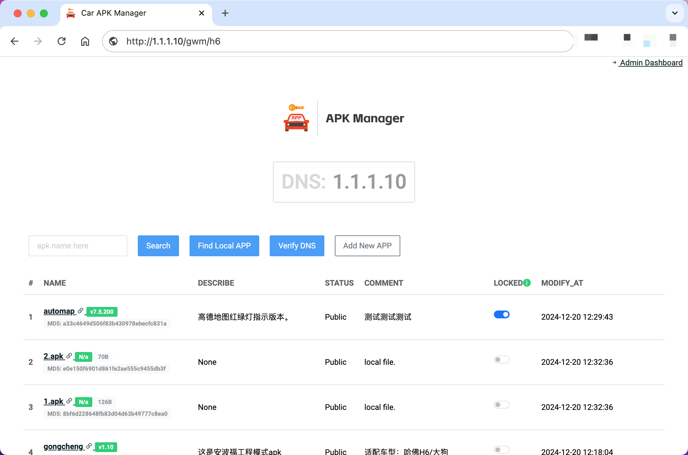

# Open Car Apk Manager

这是一个集成Local DNS和web下载服务的工具集，提供给车友爱好者自行升级车机app的私有平台。

This is a toolkit that integrates Local DNS and web download services, providing a private platform for car enthusiasts to upgrade car machine apps on their own.



## Support car models

* GWM
  * Haval H6
  * Haval Dargo Gen1 ?
  * Tank 300 ?

## Attention

注意：任何第三方apk安装办法均存在风险，该项目仅用于技术交流，请勿用于盈利。同时务必注意：当前所有升级地图的方法均存在各种BUG，社区并没有完美地图方案。

## How to Use

> 使用此方案可能有一定的技术要求：1). 会使用[docker](https://www.runoob.com/docker/docker-tutorial.html)。2). 有一台可以安装docker容器的闲置笔记本或者临时购买一台云主机(操作系统最好是Linux)

### Step1：部署服务端

```sh
# !!!使用前说明：
# 1. export ENTRY_IP="x.x.x.x" 替换为自己云服务器的公网IP；
#    如果本地部署，则需要填写笔记本电脑的局域网IP。
# 2. `-v` apk存放在云存储(类似阿里云OSS)可以忽略此配置；
#    如果apk包使用本地存储时需要将本地目录挂在到docker容器，
#    点击"Find Local APP"按钮，可以一键导入本地所有app。

$ export ENTRY_IP="10.10.100.100"
$ docker run -d -it --name car_apk_manager \
    --log-opt "max-size=100m" \
    --network host \
    -e ENTRY_IP=$ENTRY_IP \
    -e DJANGO_ENV=product \
    -v /path/to/apk:/opt/apk \
    --restart always \
    carfactory/car_apk_manager

# 命令行创建后台管理员
$ docker exec -it car_apk_manager \
    sh -c ". /opt/car_apk_manager/.py3/bin/activate;python manage.py createsuperuser"
```

### Step1.1：验证服务端环境配置是否正确

  > 验证前确保服务器防火墙已开放`tcp/80,443`，`udp/53`端口。

  1. 验证DNS解析是否生效。

  ```sh
  # 验证通过再进行下一步
  $ dig dzsms.gwm.com.cn @10.10.100.100 +short

  10.10.100.100
  ```

  2. 验证API接口是否可访问。浏览器或者`curl`命令行访问车机的API版本更新接口是否能正常获取数据，出现以下类似请求结果说明设置正确：

  ```sh
  $ curl -k --resolve dzsms.gwm.com.cn:443:10.10.100.100 \
      https://dzsms.gwm.com.cn/apiv2/car_apk_update

  {
    "code": 200,
    "message": "Query OK. APK download url unconfigured or unlocked.",
    "data": ""
  }
  ```

### Step2：访问web服务(http://<ENTRY_IP>:80)，上传Apk文件

  1. 使用本地存储作为apk存储媒介：
     1. 执行如上docker run命令时，通过`-v`参数将本地的apk存放目录挂载到docker容器；
     2. 点击"Find Local APP"按钮，可以一键导入本地所有app信息。

  2. 使用云端对象存储作为apk存储媒介：
     1. 首先将apk文件上传到云端存储服务
     2. 点击"Add New APP"按钮，将app信息录入系统中。

  首次上传完apk文件后，需要管理员登陆后台(http://<ENTRY_IP>/dash/2024/)手动锁定一个车机系统更新的app，才可接下来的车机联网配置。因为车机接口限制问题，每次更新同时只允许一个app包升级/安装。

### Step3：配置车机联网相关的操作步骤(待完善)

  1. 安装`工程模式.apk`前需要确认主机厂商：华阳、安波福；
  2. 手机启用热点并将DNS设置为`$ENTRY_IP`；笔记本无线建议关闭ipv6服务；
  3. 车机暂时关闭移动数据流量，连接手机热点，然后点击中控屏桌面的"智慧手册App"，此时会有弹窗提醒，核实确认是自己需要安装的APP，点击"升级"即可安装；
  4. 安装完成，手关闭热点，笔记本电脑DNS、ipv6改回原有设置；

## How to Build

**Pre-requisites**

In order to run the build environment, you will need to have the following tools installed:

* Docker - https://docs.docker.com/engine/install/

```sh
$ git clone https://github.com/car-factory/car_apk_manager.git car_apk_manager
$ cd car_apk_manager
$ docker build --no-cache -t car_apk_manager \
    --build-arg DJANGO_ENV=product .
```

## FAQ

1. 车机如何进入工程模式？

中控台车机系统点击进入【系统设置】，多次点击【版本号】，提示输入密码进入工程模式。

```txt
安波福主机密码: *#34434ab
华阳主机密码: adayo2002

如上面密码无法进入工程模式，可以尝试以下老版本的密码：

*#4435ab
*#1138ab
*#1831aa

```

2. 安波福主机和华阳主机的区别

安波福不能直接装软件，但安装后软件能显示；华阳可以直接装软件，但默认桌面不显示图标，需要使用第三方桌面。

## Contributing

There are many ways to contribute to Car-Apk-Manager:

* Submit [bug reports](https://github.com/car-factory/car_apk_manager/issues) and [feature requests](https://github.com/car-factory/car_apk_manager/issues)
* Upvoting [popular feature requests](https://github.com/car-factory/car_apk_manager/issues?q=is%3Aissue+is%3Aopen+label%3A%22enhancement%22) to show your support

## Ref

* [【开源】第三代哈弗H6、哈弗大狗、坦克300，车机升级地图、安装软件全流程打通](https://90apt.com/5089)
* [各种车机升级软件分享](https://www.123pan.com/s/tinSVv-2aVsh.html)
* [在线生成文件MD5](https://tool.lu/filehash/)
